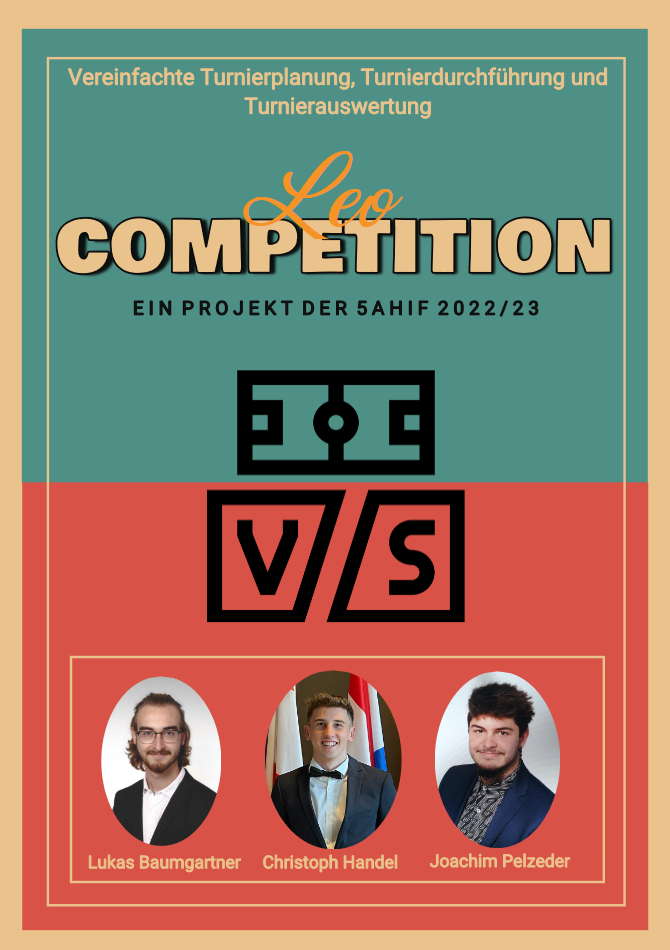

# LeoCompetition 


LeoCompetition ist ein Turnierverwaltungsprogramm,
welches die Planung, Durchführung und Auswertung eines Turniers erleichtert.
Durch das Deployment kann man ein Turnier mittels unten angeführten Link durchführen.
Für Handys verwenden Sie den 
<details>
    <summary>QR-Code</summary>


</details>

## Links

* <a href="https://github.com/htl-leonding-project/2022-4ahif-leo-competition" target="_blank"> Repository </a>

* <a href="https://htl-leonding-project.github.io/2022-4ahif-leo-competition/" target="_blank"> Gh-Pages </a>

* <a href="https://vm81.htl-leonding.ac.at/projects/2ff43c91-dfb6-41f1-a53c-055d062b0a93" target="_blank"> YouTrack </a>

## Poster



## [Open Poster](asciidocs/images/LeoComp_Plakat.pdf)


## Deployment

### Beschreibung

Immer wenn ein Push Ereignis wie ein Merge oder ein Commit auf dem Main Branch ausgeführt wird, baut Github Actions ein mehrstuefiges Docker Image unserer Quarkus Anwendung. Anschließend wird das Image in die Github Container Registry gepusht.

Nach diesem Schritt wird der Deploy-Job gestartet und die Änderungen werden in den k8s-Manifesten aktualisiert.

Zuletzt wird ein Trigger ausgefuehrt, der das neueste Image aus der Github Container Registry zieht und das leocloud-demo deployment neu startet.

Mithilfe von Flags, die wir extra für unsere Datenbank angelegt haben, können wir festlegen, ob die DB neu gestartet werden sollte oder nicht.


<details>
    <summary>Aktuelle Version</summary>


* <a href="https://student.cloud.htl-leonding.ac.at/c.handel/leocompetition/home" target="_blank"> Link </a>

</details>

## Frontend


## Diagramme

<details>
    <summary>Datenbank</summary>


</details>

<details>
    <summary>Zustandsdiagramm</summary>


</details>

<details>
    <summary>Use-Case</summary>


</details>

## Cypress

<details>
    <summary>Install Cypress</summary>

    npm install --save-dev cypress
    npm install -D cypress-slow-down

</details>

<details>
    <summary>Start Cypress</summary>

1. Start DerbyDb
2. Start Quarkus App
3. Start Angular App
4. Start Cypress with
```
npx cypress open
```
</details>

<details>
    <summary>Use Cypress</summary>

1. Select E2E Testing


2. Choose your preferred Browser


3. Start the "create-demo-tournament" Test


4. The Test is finished


</details>
