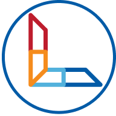

# LeoCompetition 



LeoCompetition ist ein Turnierverwaltungsprogramm,
welches die Planung, Durchführung und Auswertung eines Turniers erleichtert.
Momentan wird die Turniersimulierung durch UnitTests und Cypress Tests durchgeführt.

## Frontend


## Diagramme

<details>
    <summary>Datenbank</summary>


</details>

<details>
    <summary>Use-Case</summary>


</details>

## Links

Repository: https://github.com/htl-leonding-project/2022-4ahif-leo-competition

GitHub-Pages: https://htl-leonding-project.github.io/2022-4ahif-leo-competition/

YouTrack: https://vm81.htl-leonding.ac.at/projects/2ff43c91-dfb6-41f1-a53c-055d062b0a93

## Cypress

<details>
    <summary>Install Cypress</summary>

    npm install --save-dev cypress
    npm install -D cypress-slow-down

</details>

<details>
    <summary>Start Cypress</summary>

1. Start DerbyDb
2. Start Quarkus App
3. Start Angular App
4. Start Cypress with
```
npx cypress open
```
</details>

<details>
    <summary>Use Cypress</summary>

1. Select E2E Testing


2. Choose your preferred Browser


3. Start the "create-demo-tournament" Test


4. The Test is finished


</details>
