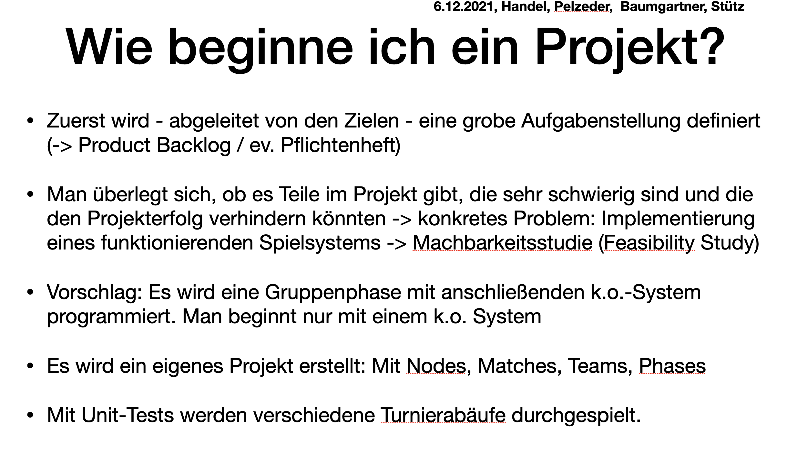
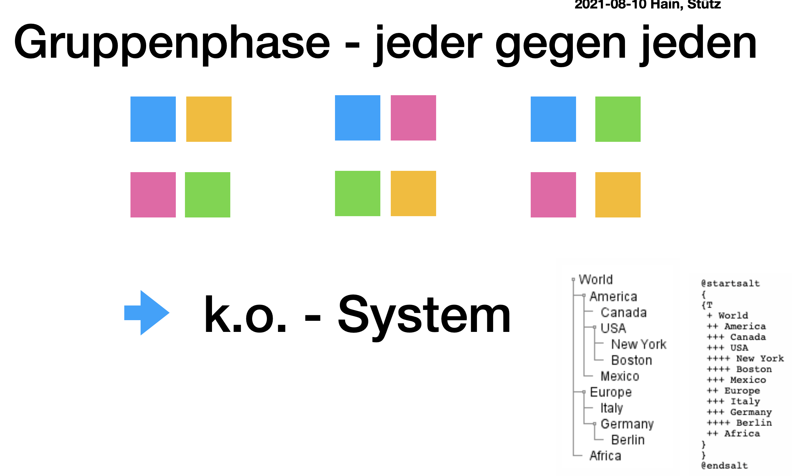
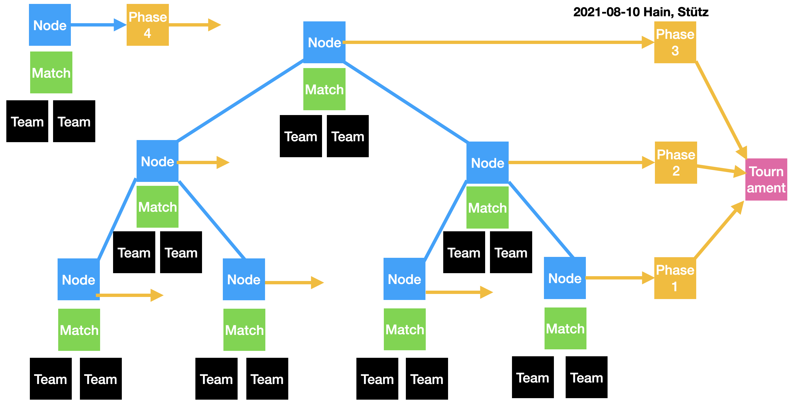
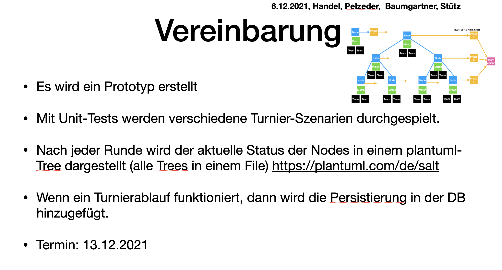

= Besprechungsprotokoll 06.12.2021
1.0, 2021-12-06
ifndef::imagesdir[:imagesdir: ../images]
:icons: font
//:sectnums:    // Nummerierung der Überschriften / section numbering
//:toc: left

//Need this blank line after ifdef, don't know why...
ifdef::backend-html5[]

// https://fontawesome.com/v4.7.0/icons/

.Teilnehmer
|===
|anwesend

|Christoph Handel

|Lukas Baumgartner

|Joachim Pelzeder

|Thomas W. Stütz

|===

.Ort und Zeit
[cols=2*]
|===
|Ort
|Online-Unterricht (Discord)

|von-bis
|Mo. 06.12.2021 - 3.EH
|Dauer
|50 min
|===

== Besprochene Themen

Funktionsweise des ko-Systems wurde durchgedacht

Spielablauf eines Turniers:

== Vereinbarungen und Entscheidungen

Vereinbarungen sind die einzelnen Punkte die auf dem folgendem Bild aufgelistet worden.

