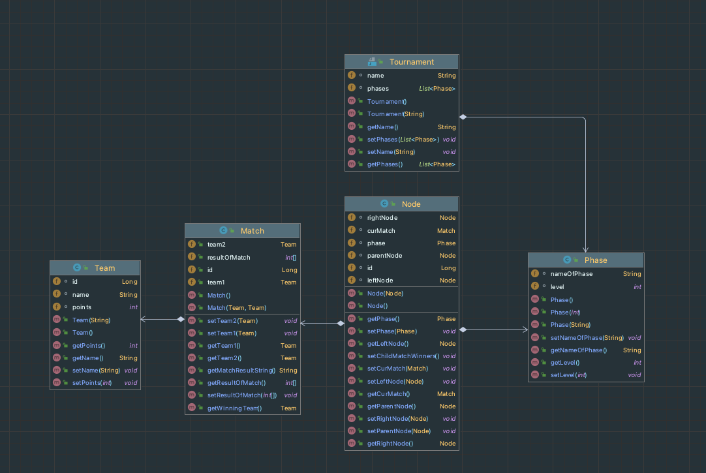

= Besprechungsprotokoll 17.01.2022
1.0, 2022-01-17
ifndef::imagesdir[:imagesdir: ../images]
:icons: font
//:sectnums:    // Nummerierung der Überschriften / section numbering
//:toc: left

//Need this blank line after ifdef, don't know why...
ifdef::backend-html5[]

// https://fontawesome.com/v4.7.0/icons/

.Teilnehmer
|===
|anwesend

|Christoph Handel

|Lukas Baumgartner

|Joachim Pelzeder

|Thomas W. Stütz

|===

.Ort und Zeit
[cols=2*]
|===
|Ort
|Unterricht

|von-bis
|Mo. 17.01.2022 - 3.EH
|Dauer
|25 min
|===

== Besprochene Themen

* Die bereits erledigten Schritte wurden besprochen und vor der Klasse auf der Tafel gezeigt.

* Dazu sind wir noch auf Github die Commits durchgegangen.

* diagram.puml, FileWriter und die PrototypeTest's wurden vorrangig gezeigt.

== Vereinbarungen und Entscheidungen

* Bei den Repository Klassen Panache implementieren.

* Protokolle überarbeiten und falls notwendig neu schreiben.

* Diagram vergleichen mit dem alten Klassendiagram vergleichen und falls notwendig fehlende Felder oder Methoden hinzufügen.

* Eine Gruppenphase mit UnitTests simulieren.
Diese UnitTests auf einen eigenen Branch pushen -> wenn alles korrekt ist, branch nach main mergen danach gruppenphase-branch löschen

* Überlegen mit welcher Frontend Technologie wir  arbeiten möchten

