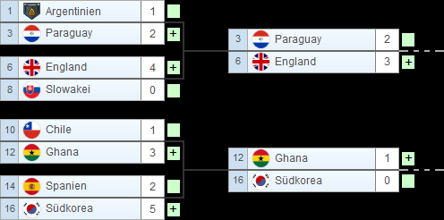

= Besprechungsprotokoll 21.06.2022
1.0, 2022-06-21
ifndef::imagesdir[:imagesdir: ../images]
:icons: font
//:sectnums:    // Nummerierung der Überschriften / section numbering
//:toc: left

//Need this blank line after ifdef, don't know why...
ifdef::backend-html5[]

// https://fontawesome.com/v4.7.0/icons/

.Teilnehmer
|===
|anwesend

|Christoph Handel

|Lukas Baumgartner

|Joachim Pelzeder

|Thomas W. Stütz

|===

.Ort und Zeit
[cols=2*]
|===
|Ort
|HTBLA Leonding

|von-bis
|09:08-10:50
|Dauer
|2 Einheiten
|===

== Besprochene Themen

* Test's -> EntityTest,

* Die Webseite (localhost)

** Team hinzufügen, Team scheint in Datenbank auf.

* Datenmodell wurde angeschaut.

* AggregateRepository von Microsoft wurde an der Tafel erklärt.

== Vereinbarungen und Entscheidungen

*  Die Tests in Unterordner (boundary, controll, entity) eingliedern.

*  Rechtschreibung überprüfen. (Ergebnis nicht Ergebniss, Resource nicht Ressource)

* Ein Dashboard sollte am Startscreen angezeigt werden
 (Anzahl der Turniere, Wie viele Teams gibt es? etc.)

* Ein Infoblock ein Actionblock

* Die Liste der Teams sollte sortiert sein, die Liste sollte detailierter sein.
(Points auf Webseite, Total_Wins in Datenbank)

* Datenbank überarbeiten (Eine Gruppe zeigt auf ein Turnier.
Ein Turnier hat mehrere Gruppen)

* Zu welcher Gruppe gehört welches Match.

* Tests auf verschiedenen Ebenen

1. Entity

2. Repository Integrationstest mit @QuarkusTest

3. Systemtest (über REST Endpoints)

* Teamanzahl auswählen statt 4 x Teams nur 4 Teams

* Übersichtsliste mit eventuellem Filter wenn man sich die Endrrgebnisse anschauen möchte

* Turnierplan-puml wird umgebaut, statt Team A vs. Team B wird
 Team A und Team B mit den jeweiligen Punkten unterhalb stehen.

* Beispiel (natürlich im Puml Design):

